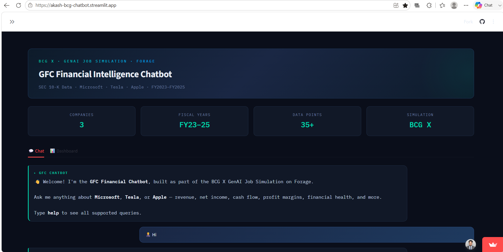
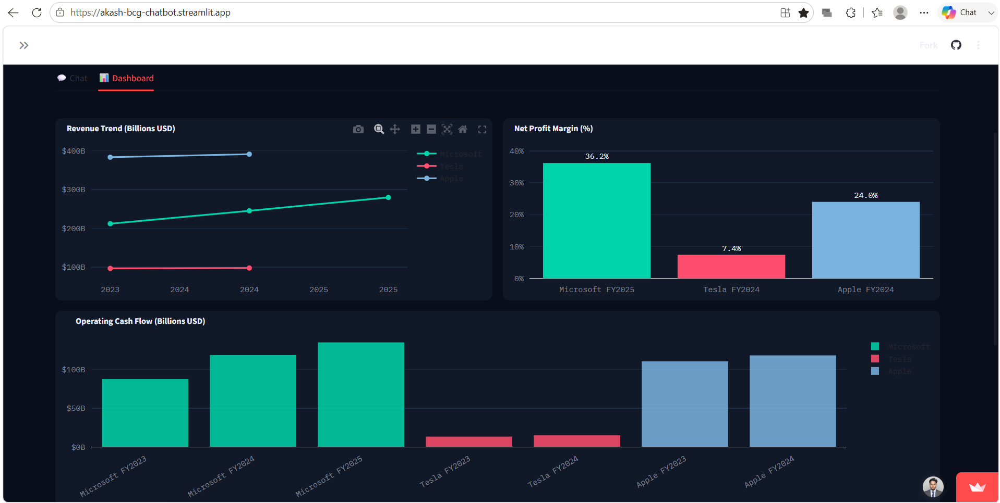

# GFC Financial Chatbot — BCG X GenAI Job Simulation

An AI-powered financial analysis chatbot built with Streamlit, developed as part of the BCG X GenAI Job Simulation on Forage. The app answers natural-language questions about company financials (revenue, net income, profit margins, cash flow, financial health) and visualizes trends across multiple fiscal years.
## Preview





## Features

- **Conversational financial Q&A** — ask questions in plain English like *"What is Microsoft's revenue in 2024?"* or *"How has Tesla's net income changed?"*
- **Multi-company coverage** — Microsoft, Tesla, and Apple, with FY2023–FY2025 data sourced from SEC 10-K filings
- **Comparative analysis** — ask the bot to compare revenue or profit margins across all companies
- **Financial health scoring** — computes debt-to-asset ratio, shareholder equity, and profit margin to flag overall financial health
- **Interactive dashboard tab** — Plotly charts for revenue trends, profit margins, and operating cash flow, plus a full raw-data table
- **Custom dark UI** — hand-styled chat bubbles, metric cards, and sidebar built with custom CSS
- **Quick-query sidebar buttons** — one-click access to common questions without typing

## Tech Stack

- **Python**
- **Streamlit** — web app framework
- **Pandas** — data handling
- **Plotly** — interactive charts (line, bar)

## How It Works

The chatbot uses rule-based intent detection (keyword matching for company names, years, and financial terms like "revenue," "margin," "cash flow," "compare") rather than an LLM API, keeping it fully self-contained and free to run. Financial data is stored as a structured dictionary and queried through helper functions that compute metrics like YoY change, profit margin, and financial health on the fly.

## Run Locally

```bash
pip install streamlit pandas plotly
streamlit run app.py
```

## Example Queries

- "What is Apple's profit margin in 2023?"
- "Compare revenue of all companies"
- "Microsoft financial health 2024"
- "Which company has the best margin?"

## Data Source

Figures are illustrative, based on publicly available SEC EDGAR 10-K filings, in billions of USD.

## Author

**Akash Kumar Sukla** — BCA Student, Dr. B.C. Roy Engineering College (MAKAUT)
Built during the BCG X GenAI Job Simulation, May 2026.
